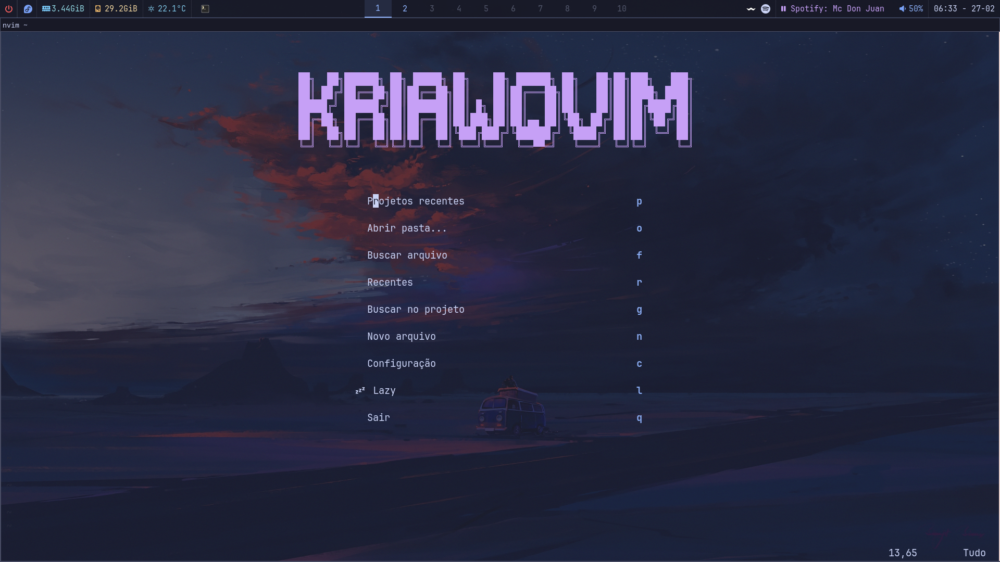
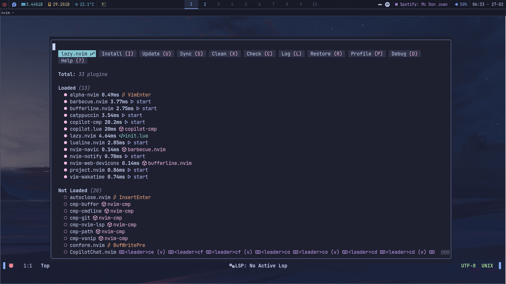
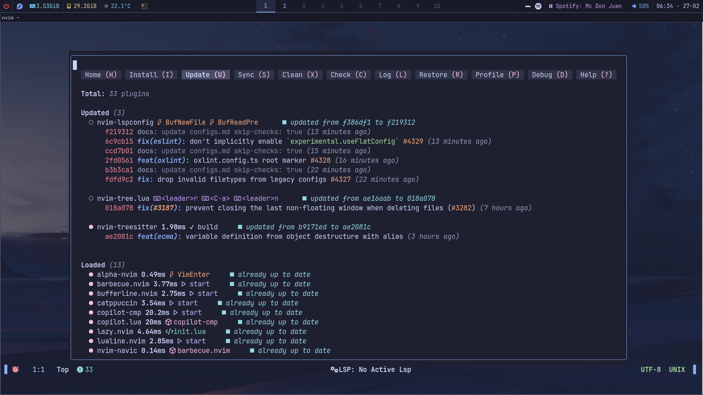
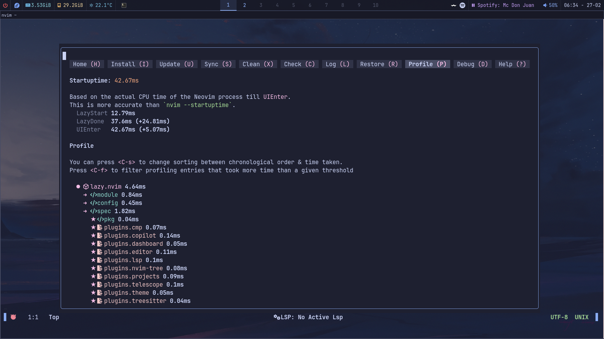

```
██╗  ██╗██████╗ ██╗ █████╗ ██╗    ██╗ ██████╗ ██╗   ██╗██╗███╗   ███╗
██║ ██╔╝██╔══██╗██║██╔══██╗██║    ██║██╔═══██╗██║   ██║██║████╗ ████║
█████╔╝ ██████╔╝██║███████║██║ █╗ ██║██║   ██║██║   ██║██║██╔████╔██║
██╔═██╗ ██╔══██╗██║██╔══██║██║███╗██║██║▄▄ ██║╚██╗ ██╔╝██║██║╚██╔╝██║
██║  ██╗██║  ██║██║██║  ██║╚███╔███╔╝╚██████╔╝ ╚████╔╝ ██║██║ ╚═╝ ██║
╚═╝  ╚═╝╚═╝  ╚═╝╚═╝╚═╝  ╚═╝ ╚══╝╚══╝  ╚══▀▀═╝   ╚═══╝  ╚═╝╚═╝     ╚═╝
```
>  Minha config pessoal feita do zero, 100% Lua, sem starter kits.

---

## Screenshots

| Dashboard | Editor |
|:---:|:---:|
|  |  |

| lazy.nvim — plugins | lazy.nvim — update | lazy.nvim — startup |
|:---:|:---:|:---:|
|  |  |  |

---

## Sobre

KriawqVim é a minha configuração pessoal do Neovim. Foi construída manualmente, sem depender de distribuições como LazyVim ou AstroVim, com o objetivo de ter controle total sobre cada detalhe do editor.

**Princípios:**
- Tudo em Lua puro — sem VimScript
- Cada plugin tem seu próprio arquivo em `lua/plugins/`
- Lazy-loading agressivo para startup rápido
- Fácil de entender, fácil de modificar

---

## Início rápido

```bash
# 1. Faça backup da config atual (se houver)
mv ~/.config/nvim ~/.config/nvim.bak

# 2. Clone a config
git clone https://github.com/KriawqZero/nvim ~/.config/nvim

# 3. Marcar instalador como executável 
cd ~/.config/nvim && chmod +x install-deps.sh

# 4. Instale as dependências de sistema
sudo ./install-deps.sh

# 4. Abra o Neovim — lazy.nvim instala os plugins automaticamente
nvim
```

Na primeira abertura o lazy.nvim se instala e logo após instala todos os plugins. Aguarde terminar e reinicie o Neovim.

**Requisitos mínimos para o editor funcionar:**
- Neovim 0.10+
- `git` (para o lazy.nvim e o Telescope)
- `rg` / ripgrep (para busca de texto no Telescope)
- Uma [Nerd Font](https://www.nerdfonts.com/) no terminal (ícones do dashboard e nvim-tree)

---

## install-deps.sh

O script instala todas as dependências de sistema necessárias para o KriawqVim funcionar completamente: Neovim, servidores LSP, formatadores, compiladores, runtimes e ferramentas opcionais.

**Distros suportadas:** Arch Linux · Fedora · Debian/Ubuntu · Void Linux

### Modos de execução

```bash
bash install-deps.sh
```

Ao iniciar, pergunta o modo:

| Modo | Comportamento |
|---|---|
| **Automático** | Instala tudo sem perguntar |
| **Interativo** | Pergunta antes de cada dependência (padrão) |
| **Só opcionais** | Pula obrigatórios, pergunta apenas os extras |

### O que é instalado

**Obrigatório:**
- `neovim`, `git`, `curl`, `ripgrep`, `fd`, build tools
- Compiladores C/C++: `gcc`, `clang`, `clangd` (Treesitter precisa para compilar parsers)
- Node.js + npm
- Python 3 + pip
- Go
- Rust via rustup (com `clippy` e `rustfmt`)

**Servidores LSP (via npm):**
`intelephense` · `typescript-language-server` · `eslint` · `tailwindcss-language-server` · `pyright` · `vscode-langservers-extracted` (HTML/CSS/JSON)

**Formatadores:**
`prettier` · `stylua` · `black` · `blade-formatter` · `gofmt/gofumpt` · `rustfmt` · `php-cs-fixer` (se composer disponível)

**LSP nativos:**
`rust-analyzer` · `gopls` · `staticcheck`

**Opcionais (pergunta independente do modo):**
- `fish` — shell padrão do terminal embutido
- `lazygit` — git TUI (ótimo com o toggleterm)
- `wl-clipboard` ou `xclip` — clipboard entre Neovim e sistema

**Fontes:**
- Hack Nerd Font (ícones do dashboard, nvim-tree, lualine)

### Verificação final

O script termina com um resumo colorido mostrando o que foi instalado e o que está faltando:

```
── Essenciais ──────────────────────────────
 [ OK ] nvim: /usr/bin/nvim
 [ OK ] git: /usr/bin/git
[WARN] rg: não encontrado (reinicie o terminal se acabou de instalar)

── Servidores LSP ──────────────────────────
 [ OK ] typescript-language-server: /usr/local/bin/typescript-language-server
...
```

---

## Estrutura

```
~/.config/nvim/
├── init.lua                    ← entry point: define leader, carrega os módulos
├── README.md                   ← documentação
├── KEYBINDS.md                 ← referência completa de atalhos
├── install-deps.sh             ← instalador de dependências de sistema
├── lazy-lock.json              ← versões fixas dos plugins (commitar!)
│
├── lua/
│   ├── config/                 ← configurações do editor (sem plugins)
│   │   ├── options.lua         ← vim.opt — indentação, busca, aparência
│   │   ├── keymaps.lua         ← keybinds globais (splits, buffers, LSP)
│   │   ├── autocmds.lua        ← autocommands (filetype, yank highlight)
│   │   └── lazy.lua            ← bootstrap + setup do lazy.nvim
│   │
│   ├── lualine/
│   │   └── cat_lualine.lua     ← tema customizado da statusbar
│   │
│   └── plugins/                ← specs do lazy.nvim (1 arquivo por responsabilidade)
│       ├── theme.lua           ← catppuccin
│       ├── dashboard.lua       ← tela inicial (alpha-nvim / KriawqVim)
│       ├── lsp.lua             ← LSP nativo (nvim 0.11+)
│       ├── cmp.lua             ← autocompletar (nvim-cmp)
│       ├── treesitter.lua      ← syntax avançada
│       ├── telescope.lua       ← busca de arquivos e texto
│       ├── projects.lua        ← projetos recentes (project.nvim)
│       ├── nvim-tree.lua       ← explorador de arquivos
│       ├── ui.lua              ← lualine, bufferline, barbecue, ibl, notify
│       ├── editor.lua          ← edição: conform, comments, surround, trouble, colorizer
│       └── copilot.lua         ← GitHub Copilot + CopilotChat
│
└── after/
    ├── ftplugin/
    │   └── blade.lua           ← opções para .blade.php
    └── queries/blade/          ← treesitter queries para Blade
```

---

## Tema

**Catppuccin Macchiato** com fundo transparente.

O tema é carregado com prioridade máxima (`priority = 1000`) para evitar flash de cores no startup. Todas as integrações (nvim-tree, telescope, bufferline, barbecue, indent-blankline, notify, copilot) estão habilitadas.

Para trocar o flavour, edite `lua/plugins/theme.lua`:

```lua
flavour = 'macchiato',  -- latte | frappe | macchiato | mocha
```

---

## Plugins

### UI & Aparência
| Plugin | Função |
|---|---|
| `catppuccin/nvim` | Tema principal |
| `goolord/alpha-nvim` | Dashboard de boas-vindas (KriawqVim) |
| `nvim-lualine/lualine.nvim` | Statusbar customizada |
| `akinsho/bufferline.nvim` | Tabs de buffers |
| `utilyre/barbecue.nvim` | Breadcrumbs (classe/função atual) |
| `lukas-reineke/indent-blankline.nvim` | Guias de indentação |
| `rcarriga/nvim-notify` | Notificações elegantes |
| `nvim-tree/nvim-web-devicons` | Ícones para arquivos |

### Navegação
| Plugin | Função |
|---|---|
| `nvim-tree/nvim-tree.lua` | Explorador de arquivos lateral |
| `nvim-telescope/telescope.nvim` | Busca fuzzy de arquivos, texto, buffers |
| `ahmedkhalf/project.nvim` | Histórico de projetos, detecção automática de root |

### LSP & Autocompletar
| Plugin | Função |
|---|---|
| `neovim/nvim-lspconfig` | Configuração de servidores LSP |
| `hrsh7th/nvim-cmp` | Motor de autocompletar |
| `hrsh7th/cmp-nvim-lsp` | Fonte LSP para o cmp |
| `hrsh7th/cmp-buffer` | Fonte: texto do buffer atual |
| `hrsh7th/cmp-path` | Fonte: caminhos de arquivos |
| `L3MON4D3/LuaSnip` | Engine de snippets |
| `rafamadriz/friendly-snippets` | Biblioteca de snippets prontos (multi-linguagem) |
| `saadparwaiz1/cmp_luasnip` | Integração LuaSnip com nvim-cmp |
| `roobert/tailwindcss-colorizer-cmp.nvim` | Preview de cores/classes Tailwind no completion |
| `nvim-treesitter/nvim-treesitter` | Syntax highlighting avançada + indentação |
| `windwp/nvim-ts-autotag` | Fecha/renomeia tags automaticamente |

### Servidores LSP ativos
`intelephense` · `html` · `cssls` · `tailwindcss` · `ts_ls` · `eslint` · `rust_analyzer` · `gopls` · `clangd` · `pyright`

### Editor
| Plugin | Função |
|---|---|
| `m4xshen/autoclose.nvim` | Fecha `(`, `[`, `{`, `"` automaticamente |
| `akinsho/toggleterm.nvim` | Terminal embutido |
| `stevearc/conform.nvim` | Formatação de código por filetype |
| `terrortylor/nvim-comment` | Comentários rápidos (`gcc`, `gc`) |
| `kylechui/nvim-surround` | Manipular aspas/tags/parênteses ao redor de texto |
| `folke/trouble.nvim` | Painel de diagnósticos, references e quickfix |
| `NvChad/nvim-colorizer.lua` | Preview de cores (hex/rgb/hsl/Tailwind) |
| `prisma/vim-prisma` | Suporte a Prisma ORM |
| `wakatime/vim-wakatime` | Rastreamento de tempo de codificação |

### IA
| Plugin | Função |
|---|---|
| `zbirenbaum/copilot.lua` | GitHub Copilot (sugestões via cmp) |
| `zbirenbaum/copilot-cmp` | Integração do Copilot com nvim-cmp |
| `CopilotC-Nvim/CopilotChat.nvim` | Chat interativo com o Copilot |

---

## Keybinds

`<leader>` = `Espaço`

> Referência completa com explicação de cada keybind (built-ins + plugins): **[KEYBINDS.md](./KEYBINDS.md)**

### Globais

| Keybind | Modo | Ação |
|---|---|---|
| `<C-s>` | Normal / Insert / Visual | Salvar |
| `<Esc>` | Normal | Limpar destaque de busca |
| `D` | Normal | Deletar linha (sem copiar) |
| `U` | Normal | Redo |
| `O` | Normal | Linha abaixo sem entrar no insert |
| `<Tab>` | Normal | Entrar no insert e indentar |

### Splits & Navegação

| Keybind | Ação |
|---|---|
| `<C-h/j/k/l>` | Mover entre splits |
| `<leader>h/l` | Redimensionar split vertical |
| `<leader>j/k` | Redimensionar split horizontal |
| `<S-l>` | Próximo buffer |
| `<S-h>` | Buffer anterior |
| `<S-w>` | Fechar buffer atual |

### LSP

| Keybind | Ação |
|---|---|
| `gd` | Ir para definição |
| `gD` | Ir para declaração |
| `gr` | Ver referências |
| `K` | Hover (documentação) |
| `<leader>rn` | Renomear símbolo |
| `<leader>a` | Code actions |
| `<C-f>` | Formatar arquivo |
| `<leader>e` | Abrir diagnóstico flutuante |
| `[d` / `]d` | Diagnóstico anterior / próximo |

### Trouble (lista de diagnósticos)

| Keybind | Ação |
|---|---|
| `<leader>xx` | Diagnósticos do workspace |
| `<leader>xX` | Diagnósticos só do buffer atual |
| `<leader>cs` | Símbolos do arquivo atual |
| `<leader>cl` | Definições/referências do LSP |
| `<leader>xL` | Location list |
| `<leader>xQ` | Quickfix list |

### Telescope & Projetos

| Keybind | Ação |
|---|---|
| `<leader>ff` | Buscar arquivos |
| `<leader>fg` | Buscar texto no projeto (live grep) |
| `<leader>fb` | Buscar buffers abertos |
| `<leader>fh` | Buscar help tags |
| `<leader>fp` | Projetos recentes (Telescope projects) |
| `<leader>fo` | Abrir pasta arbitrária como root |

### nvim-tree

| Keybind | Contexto | Ação |
|---|---|---|
| `<C-a>` | Global | Abrir / fechar a árvore |
| `<leader>r` | Global | Atualizar a árvore |
| `<leader>n` | Global | Localizar arquivo atual na árvore |
| `<CR>` / `o` | Dentro da árvore | Abrir arquivo ou pasta |
| `<BS>` | Dentro da árvore | Fechar pasta pai |
| `u` | Dentro da árvore | Ir para o diretório pai |
| `a` | Dentro da árvore | Criar arquivo / pasta |
| `r` | Dentro da árvore | Renomear |
| `d` | Dentro da árvore | Deletar |
| `R` | Dentro da árvore | Recarregar |
| `<leader>c` | Dentro da árvore | Mudar root para o nó |
| `<leader>vs` | Dentro da árvore | Abrir em split vertical |
| `<leader>hs` | Dentro da árvore | Abrir em split horizontal |

### Terminal (`toggleterm`)

| Keybind | Ação |
|---|---|
| `<S-Tab>` | Abrir / fechar terminal |

### Copilot & CopilotChat

| Keybind | Modo | Ação |
|---|---|---|
| `<leader>cc` | Normal | Abrir / fechar chat |
| `<leader>cq` | Normal | Pergunta rápida sobre o buffer |
| `<leader>ce` | Normal / Visual | Explicar código |
| `<leader>cf` | Normal / Visual | Corrigir código |
| `<leader>co` | Normal / Visual | Otimizar código |
| `<leader>cd` | Normal / Visual | Gerar documentação |
| `<leader>ct` | Normal / Visual | Gerar testes |
| `<leader>cr` | Normal / Visual | Code review |
| `<leader>cx` | Normal | Corrigir diagnóstico do LSP |
| `<leader>cg` | Normal | Gerar mensagem de commit (staged) |

**Dentro da janela do chat:**

| Tecla | Ação |
|---|---|
| `<CR>` / `<C-s>` | Enviar mensagem |
| `q` / `<C-c>` | Fechar chat |
| `<C-r>` | Resetar / limpar histórico |
| `<C-a>` | Aceitar diff sugerido |
| `<C-d>` | Mostrar diff |

### Dashboard

| Tecla | Ação |
|---|---|
| `p` | Projetos recentes (`Telescope projects`) |
| `o` | Abrir pasta com input + autocomplete |
| `f` | Buscar arquivo |
| `r` | Arquivos recentes |
| `g` | Buscar no projeto |
| `n` | Novo arquivo |
| `c` | Abrir configuração (`init.lua`) |
| `l` | Abrir `:Lazy` |
| `q` | Sair |

---

## Projetos recentes (project.nvim)

O `project.nvim` rastreia os projetos que você abre e detecta automaticamente a raiz de cada projeto via LSP ou por padrões de arquivo (`.git`, `package.json`, `Cargo.toml`, etc.).

### Fluxo de uso

| Situação | Ação |
|---|---|
| Abrir um projeto recente | Dashboard → `p` ou `<leader>fp` |
| Abrir qualquer pasta como root | Dashboard → `o` ou `<leader>fo` (input com Tab para completar) |
| Navegar para outro projeto sem fechar | `<leader>fp` e seleciona na lista |

Ao selecionar um projeto, o cwd muda automaticamente e o nvim-tree abre na nova raiz — comportamento idêntico ao VS Code / Cursor.

### Detecção automática de root

Ao abrir qualquer arquivo, o plugin identifica a raiz do projeto procurando:

```
.git  .gitignore  package.json  Cargo.toml  go.mod
pyproject.toml  Makefile  CMakeLists.txt  composer.json  .nvimrc
```

---

## Gerenciador de plugins: lazy.nvim

O lazy.nvim é instalado automaticamente no primeiro boot. Não é necessário nenhum setup manual.

### Comandos

| Comando | Ação |
|---|---|
| `:Lazy` | Abre a UI visual |
| `:Lazy sync` | Instala, atualiza e remove (tudo de uma vez) |
| `:Lazy install` | Instala plugins faltando |
| `:Lazy update` | Atualiza todos os plugins |
| `:Lazy clean` | Remove plugins fora da config |
| `:Lazy restore` | Reverte para as versões do `lazy-lock.json` |
| `:Lazy profile` | Mostra o tempo de carregamento de cada plugin |
| `:Lazy log` | Changelog dos plugins |

### Como adicionar um plugin

Crie ou edite um arquivo em `lua/plugins/` e retorne um spec:

```lua
-- lua/plugins/editor.lua
return {
  -- ... plugins existentes ...

  {
    'nvim-pack/nvim-spectre',        -- usuário/repo no GitHub
    keys = {
      { '<leader>S', '<cmd>Spectre<CR>', desc = 'Busca e substituição global' },
    },
    config = function()
      require('spectre').setup()
    end,
  },
}
```

Salve e rode `:Lazy install`. Pronto.

### Como remover um plugin

Delete ou comente o spec no arquivo correspondente. Depois rode `:Lazy clean`.

### O arquivo lazy-lock.json

Gerado automaticamente com as versões exatas de cada plugin. Commitar esse arquivo garante que a config funciona igual em qualquer máquina:

```bash
git add lazy-lock.json && git commit -m "chore: lock plugin versions"
```

Para reverter todos os plugins para as versões do lock file: `:Lazy restore`.

---

## Formatação de código (conform.nvim)

Formata ao salvar (`BufWritePre`) com timeout de 500ms. Se o formatador externo não estiver disponível, usa o LSP como fallback.

| Linguagem | Formatador |
|---|---|
| Lua | `stylua` |
| JS / TS / JSX / TSX | `prettier` |
| JSON / CSS / HTML | `prettier` |
| Blade | `blade-formatter` |
| PHP | `php_cs_fixer` |
| Python | `black` |
| Rust | `rustfmt` |
| Go | `gofmt` |

Os formatadores são instalados automaticamente pelo `install-deps.sh`.

---

## Copilot: inline vs cmp

Por padrão, as sugestões aparecem no **menu de autocompletar** (nvim-cmp), junto com LSP e snippets.

Para usar o estilo **inline (ghost text)**, edite `lua/plugins/copilot.lua`:

```lua
-- Trocar por:
suggestion = {
  enabled     = true,
  auto_trigger = true,
  keymap = {
    accept      = '<Tab>',
    accept_word = '<C-Right>',
    next        = '<M-]>',
    prev        = '<M-[>',
    dismiss     = '<C-e>',
  },
},

-- E remover/comentar o plugin copilot-cmp:
-- { 'zbirenbaum/copilot-cmp', ... }
```

> Não use os dois modos ao mesmo tempo — as sugestões ficam duplicadas.

---

## Customização rápida

### Trocar o tema
Edite `lua/plugins/theme.lua` → `flavour = 'mocha'` (ou `latte`, `frappe`, `macchiato`).

### Trocar o shell do terminal
Edite `lua/plugins/editor.lua` → `shell = 'bash'` (ou `zsh`, `fish`, etc.).

### Adicionar/remover servidores LSP
Edite `lua/plugins/lsp.lua` → lista no `vim.lsp.enable({ ... })`.

### Trocar as cores do dashboard
Edite a função `set_hl` em `lua/plugins/dashboard.lua`:

```lua
vim.api.nvim_set_hl(0, 'AlphaHeader',   { fg = '#c6a0f6', bold = true })  -- título
vim.api.nvim_set_hl(0, 'AlphaShortcut', { fg = '#8aadf4', bold = true })  -- atalhos
vim.api.nvim_set_hl(0, 'AlphaFooter',   { fg = '#6e738d', italic = true })-- rodapé
```

---

<sub>A config original (escolha de plugins, keybinds, fluxo de trabalho) foi escrita manualmente. A refatoração para Lua/lazy.nvim, a reorganização em módulos, a correção de bugs, o dashboard, o <code>install-deps.sh</code> e este README foram gerados com assistência de IA (Claude — Cursor). Estimativa: ~30% manual, ~70% IA.</sub>
